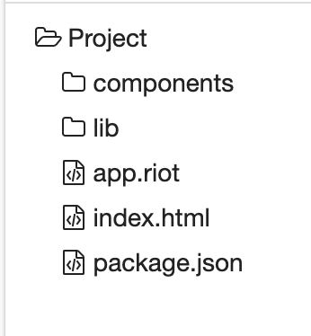

# CHAPTER 02 Riot.js の基礎

#### ▼ P50（誤植）

```diff
- +  <li each={ (item, index) in items }>{ index } : { item }</li>
+ +  <li each={ (item, index) in frameworks }>{ index } : { item }</li>
```

#### ▼ P66

突然 `components` ディレクトリについて言及していますが、 `Projects` 直下に `components` ディレクトリを作成してください。


